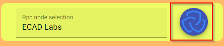
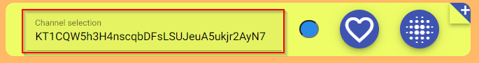
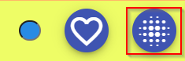
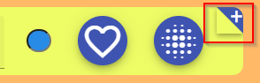

# tezosgram

## Simple decentralized messaging platform built on tezos.  
 

### What is this? 
This is a telegram inspired messaging platform in which the user can spawn "channels" in form of smart contracts. Those track the messages of the conversation and allow users of the tezos blockchain to communicate on chain.

 

### How does it work  
The underlying smart contract works really straightforward. It only exists to track the order of incoming invokations and to store the messages in an immutable fashion on the blockchain. The required data collection is handled via tzstats api and the wallet integration is done via beacon wallet, which integrates the wallet interaction standard tzip-10. Addresses which own a tzdomain name are also resolved into their domain names.

 

### Will it break on the next on chain upgrade?
This thought is justified, because nobody wants to write and pay (even though the amount is really small) for messages, which disappear every couple of months. But this probably wont happen, because as long as the apis from tzstats or similar service providers are online and the protocol doesn't change dramatically it should not affect the history of your messages. An idea which benefits the lowering of the fear is the implementation of different channel versions in order to provide downwards compability for older channels while still opening the way for the integration of new ideas. 

 

### How to use it?
* To connect your wallet via the beacon api press the button on the top right corner of the page. You dont need a connected wallet to read the channels messages, but obviously if you also want to write messages or initiate channels. 
  
* To open up a channel you first have to select a channel (contract address). Either one of the predefined channels or by directly entering the address into the textbox.
  
* Now open up the channel by clicking the button with the dot array. Btw you can also change the background color of the channel for better distinguishment and add addresses as favourites in this menu.     

* To initiate a new channel press on the plus icon on the top right corner and enter a channel name.  

 

## Improvement ideas
* hicetnunc nft profile picture integration
* better persistance/ state saving (e.g. save open channels on site refresh)
* "tag" system for channels in which you can filter and discover other channels that spark your interest
* "private" channels (permission system) where e.g. only permissioned addresses are allowed to write messages and "invite" people
* network selection for testnets
* implement a caching mechanism
* rework UI design so its compatible with mobile devices